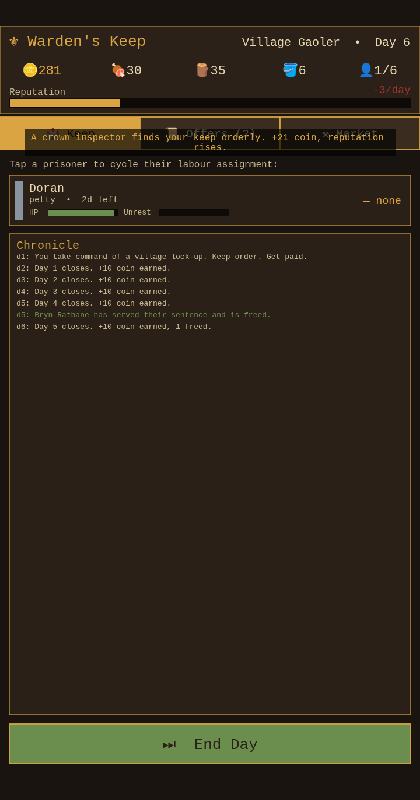

# ⚜ Warden's Keep

A medieval **jail-management** game for phones. You are the warden: keep order,
manage scarce resources, work your prisoners, and climb from a village lock-up
to keeper of the crown's most dangerous captives — without letting riots, fires,
plagues, or escapes ruin your reputation.

> Status: **playable, tested vertical slice (v0.1).** Pure deterministic
> simulation core + Phaser mobile UI, packaged for iOS/Android via Capacitor.



## Play it now

```bash
npm install
npm run dev          # open the printed localhost URL in a browser
```

📱 **No computer handy?** You can playtest the real game on your phone with zero
local setup — see **[docs/TESTING_ON_PHONE.md](docs/TESTING_ON_PHONE.md)**
(browser via GitHub Pages, or a downloadable Android APK).

Tabs: **🏰 Keep** (inmates — tap a card to assign labour) · **📜 Offers**
(accept/decline prisoners the government sends) · **⚒ Market** (buy food,
firewood, buckets; hire warders; expand cells). Press **End Day** to run the
simulation and see what the night brings.

## The loop in one breath

Accept prisoners for daily pay → feed, warm, and keep them sanitary → suppress
unrest with guards (skill keeps order, brutality kills) → optionally conscript
inmates into risky labour for resources → survive fires/disease/escapes and
**answer riots & bribes with a hard choice** → earn reputation → the crown sends
richer, deadlier prisoners. Lose if your reputation collapses or you go bankrupt.

Riots and bribes pause the day as **telegraphed trade-off decisions** (crush the
riot vs. negotiate; pocket the bribe vs. refuse) — the design is grounded in
real player-sentiment research: **[docs/research](docs/research)**.

Full design: **[docs/GAME_DESIGN.md](docs/GAME_DESIGN.md)**.

## Scripts

| Command | What it does |
|---|---|
| `npm run dev` | Vite dev server with hot reload |
| `npm run build` | Type-check + production build to `dist/` |
| `npm test` | Run the 49-test Vitest suite (core logic) |
| `npm run smoke` | Headless-Chromium boot test (needs a preview server running) |
| `npm run verify` | Build → serve → browser smoke-test, end to end |
| `npm run check` | **typecheck + tests + verify** — the full gate |

## Tech stack

- **TypeScript** strict, **Vite** bundler
- **Phaser 3** for the rendering/UI layer only
- **Vitest** (unit) + **Playwright** (headless smoke) for tests
- **Capacitor** to ship the same build natively to the App Store and Play Store

## Project layout

```
src/core/     pure simulation — no engine, no DOM, fully unit-tested
src/scenes/   Phaser GameScene (the view)
src/ui/       theme, reusable widgets, save adapter
test/         Vitest suites
scripts/      smoke.mjs (browser test) + verify.mjs (e2e runner)
docs/         design, architecture, roadmap, art direction
```

Why the core is separate from Phaser — and how the daily simulation tick works —
is documented in **[docs/ARCHITECTURE.md](docs/ARCHITECTURE.md)**.

## Shipping to phones

```bash
npm run build
npx cap add ios && npx cap add android   # once
npx cap sync                              # after every build
npx cap open ios                          # Xcode  (Apple Developer license)
npx cap open android                      # Android Studio (Play/Samsung license)
```

The road from this slice to the stores — phases, exit criteria, and the
store-readiness checklist — is in **[docs/ROADMAP.md](docs/ROADMAP.md)**.

## Contributing

See **[CONTRIBUTING.md](CONTRIBUTING.md)**. The one rule that keeps the project
healthy: **game rules go in `src/core` (with a test); `src/scenes`/`src/ui` only
render and route input.**
